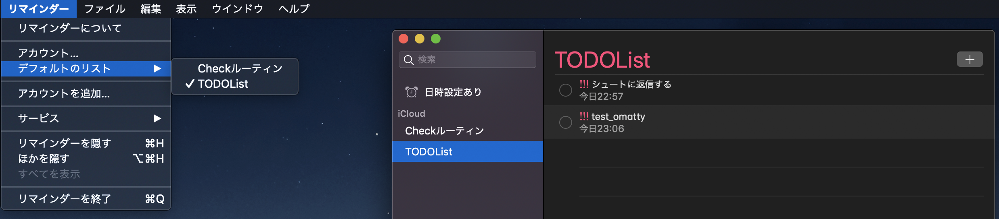
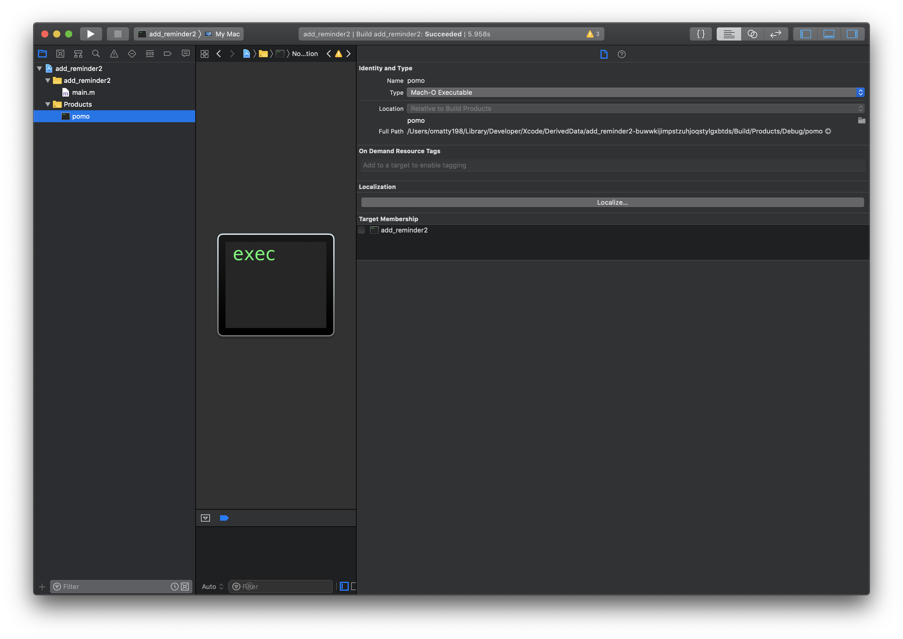

# Getting started

Set `.zshrc`

```
alias pomo='~/src/github.com/USERNAME/NewPomo/pomo $1 $2'
$1: title
$2: seconds

ex) 
pomo テストコード書く 1800;
reward コーラ飲む

// 30分後にリマインドされる かつ 餌も通知される
```

# More

1. pomo
2. toggle start
3. [Optional]open music app

```
function start () {
  local task_name=$1;
  local task2=$2;
  toggl start ${task_name};
  pomo ${task_name};
  echo "Created $task_name";
  open "https://open.spotify.com/album/012oKUlmu9qA84z4kYrOAj?si=lNEd6oFUQ0GbOQvCzfAFBA";
  if [ "$2" = "" ]; then
    sleep "1800";
  else
    echo $2;
    sleep $2;
  fi
  echo "sleeping...";
  toggl stop;
}

function reward () {
  local reward_name=$1;
  fastlane run notification message:$reward_name
}
```

## How to use

`$ start "[#issue番号][画面名][title][sub_title]"`

ex)
`$ start "[#2000][MissionList]問い合わせに飛ばすボタンつくる"`

## 参考記事

[meeDamian/toggl-cli: Manage your Toggl.com time entries from the familiarity of the nearby CLI.](https://github.com/meeDamian/toggl-cli)
[ターミナルから OSX のリマインダーに項目追加するコマンド](http://takuya-1st.hatenablog.jp/entry/2013/09/16/062801)




